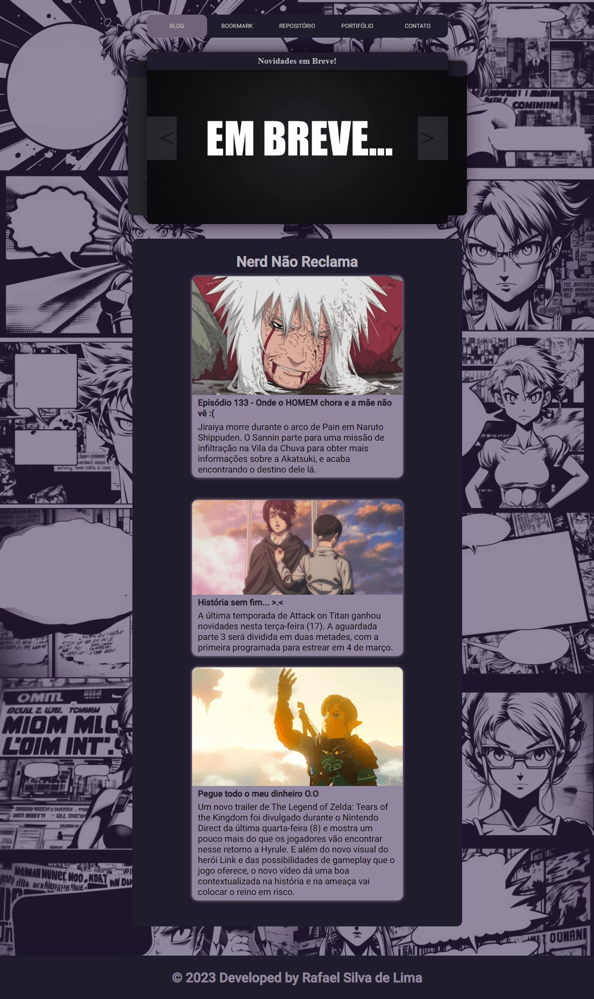
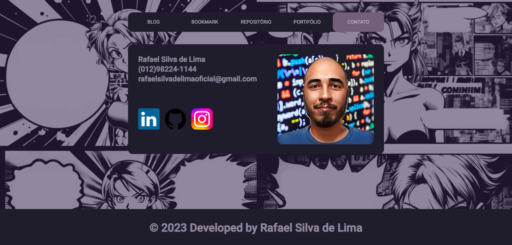

# NerdNaoReclama.

Procurando por um blog que entende a cultura geek como ninguém? Então, você precisa conhecer o projeto Nerd Não Reclama! Nós somos especializados em tudo que envolve a cultura nerd, gamer, otaku e pop em geral. E aqui, nós não reclamamos, nós compartilhamos tudo aquilo que nos faz questionar a lógica das obras que tanto amamos!

Nós somos experts em desvendar as coisas bizarras que acontecem nos animes e mangás, como o porquê de Attack on Titan parecer uma história sem fim na quarta temporada final. Ou então, como o Naruto conseguiu vencer tantos adversários com o seu famoso "Discurso no Jutsu". Tudo isso é motivo de piada, sátira e brincadeira em nosso blog.

Se você é daqueles que adora ficar por dentro de notícias inusitadas sobre a cultura pop, o blog Nerd Não Reclama é perfeito para você! Venha nos acompanhar e descubra o lado mais divertido da cultura geek!

## Pagina de Contato

# Sobre Projeto
 
Atenção!

Gostaria de informar que este projeto foi desenvolvido com o objetivo de aprimorar minhas habilidades e, posteriormente, ser adicionado ao meu portfólio. Optei por criar projetos relacionados aos meus hobbies e passatempos, tornando-os úteis e práticos no meu dia a dia.

Vale ressaltar que o projeto ainda se encontra em fase de desenvolvimento. Contudo, se você deseja dar uma olhada e acompanhar o seu progresso, sinta-se à vontade! Aproveite a oportunidade para conferir como está ficando e, quem sabe, deixar um feedback construtivo.
 
 [Clique aqui](https://nerd-nao-reclama.web.app/home) para realizar um passeio pela aplicação
 
 ## Software, framework e outros usados no processo de desenvolvimento.

 O Layout/UX inicial foi realizado no site [FIGMA](https://www.figma.com/).

 O fluxograma foi feito no site [Diagrams](https://www.diagrams.net/).

 O projeto está sendo desenvolvido no framwork [Angular](https://angular.io/).

 A parte de armazenamento, banco de dados assim como a authenticação de usuário está construida com [Firebase](https://firebase.google.com/?hl=pt-br).

 Linguagem de programação mais utilizada foi [Typescript](https://www.typescriptlang.org/)

 Projeto está em seu processo inicial, então futuramente irei preparar para vocês um "readme" mais detalhado. Desde já, grato!
